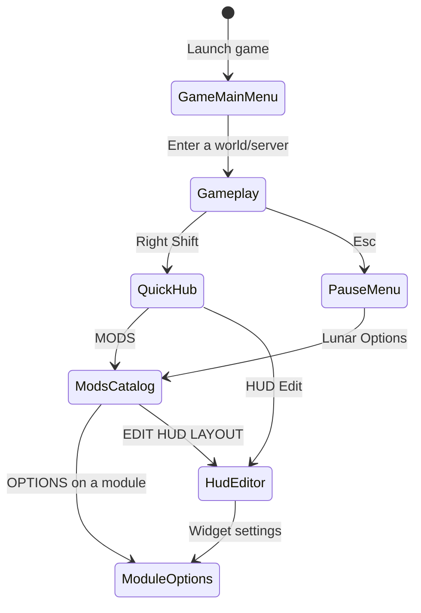

# Lunar Client 1.8.9 in-game UI study

Status: **research only — no implementation is authorized by this document**

Date: 2026-08-10

Target observed: **Lunar Client 1.8.9 (v2.22.27-2632)** running inside the
Minecraft game window. The Lunar launcher is explicitly out of scope.

This study is based on screenshots and a narrated interaction sequence supplied
by the user. It exists to prevent the next OPUS implementation from inventing a
different information architecture, shipping mock controls, or treating a
launcher/browser preview as proof of in-game behavior.

## Evidence discipline

Every statement below is tagged by evidence quality:

- **Observed** — visible directly in a supplied Lunar 1.8.9 screenshot.
- **Reported** — the user performed the action and described the result.
- **Inferred** — a high-confidence deduction from two or more captures; it must
  still be verified in the real game before implementation is accepted.
- **Unknown** — not visible or exercised yet. It requires another user-assisted
  capture; it must not be guessed.

Reference captures:

| Id | Screenshot | State |
| --- | --- | --- |
| L1 | `codex-clipboard-efe2ab46-3e31-41ea-bed2-f1d719356c46.png` | Lunar-rendered game main menu immediately after launch |
| L2 | `codex-clipboard-dab953d6-903b-480d-ac2a-705eec0da684.png` | Gameplay after pressing Right Shift |
| L3 | `codex-clipboard-cef72007-0999-429c-9e1a-21a1f0a1956f.png` | Mods catalog opened from the Right Shift hub |
| L4 | `codex-clipboard-11422567-c8e4-4965-91e3-e569b23de487.png` | Armor Status module options |
| L5 | `codex-clipboard-7fefccc9-5436-4e12-a365-330f87cbf8bd.png` | Catalog at its first module rows |
| L6 | `codex-clipboard-9401ad3b-a5cf-470d-91c6-8cae5bb5dcab.png` | Catalog scrolled to later rows |
| L7 | `codex-clipboard-463da4a3-1f89-4131-8fa6-d9fcb3763717.png` | Catalog scrolled to later rows |
| L8 | `codex-clipboard-7c422779-f7b9-4d5e-a9c6-d410d26616ad.png` | Catalog scrolled to later rows |
| L9 | `codex-clipboard-cc4513a3-7ec4-4388-ada4-14f5ba0459d2.png` | Confirmed catalog destination after `Esc → Lunar Options` |
| L10 | `codex-clipboard-b6c2f3eb-b2dc-4c62-93ad-73093a31caad.png` | HUD Editor widget hover controls |

Pixel measurements are taken from the supplied raster captures and should be
treated as approximately ±3–5 px because of window chrome, capture cropping,
and Minecraft GUI scaling.

## Executive findings

1. **There is not one universal config screen.** Right Shift opens a compact
   hub over gameplay. Its `MODS` action opens the full Mods workspace.
   **Observed + Reported.**
2. **The pause-menu route is intentionally shorter.** `Esc → Lunar Options`
   opens the Mods catalog directly; it does not pass through the compact hub or
   an intermediate placeholder screen. The user explicitly identified L9 as
   the resulting screen. **Observed destination + Reported transition.**
3. **Catalog and module options share one stable shell.** The top bar, profile
   rail, panel bounds, translucent game background, and close action remain;
   only the main content region changes. **Observed.**
4. **Gameplay is the live context, not decorative wallpaper.** The world,
   vanilla HUD, and already-enabled Lunar HUD widgets remain visible around and
   through the translucent UI. **Observed.**
5. **The overlay shell adds no permanent FPS/CPS diagnostic at the top-left.**
   The FPS, memory, counters, armor, effects, and similar elements visible in
   L2–L4 are independently enabled HUD modules in the user's Lunar profile.
   **Observed + Reported.**
6. **A module card has two distinct jobs.** It exposes configuration through an
   `OPTIONS` row and exposes current on/off state through a dedicated colored
   state row. The detail view exposes the module's real settings in-place.
   **Observed.**
7. **The workspace is dense but structurally simple.** There is one header, one
   fixed profile rail, one catalog toolbar, one scroll area, and a three-column
   grid. There is no dashboard breadcrumb, inspector dock, fake preview canvas,
   or nested card hierarchy. **Observed.**
8. **HUD editing reuses the canonical module system.** Both the HUD Edit action
   from the Right Shift hub and `EDIT HUD LAYOUT` from the catalog enter the same
   editor. A widget's settings action opens the same module-detail UI and the
   same underlying module configuration as `Mods → module → OPTIONS`.
   **Observed controls + Reported routing and identity.**

## Observed state model



The destination of the remaining non-HUD side button in `QuickHub`, the
close/escape behavior of several states, and the back destination from module
options are still unknown. They are deliberately not drawn as facts.

## Screen A — game main menu replacement

Evidence: L1, 1280 × 747.

### What is present

- **Observed:** Lunar renders a complete game main menu inside the Minecraft
  window. This is not the separate desktop launcher.
- **Observed:** the animated/panoramic world fills the viewport and is heavily
  blurred; menu controls and text are drawn sharply above it.
- **Observed:** a central brand stack contains the Lunar mark, then two full
  width actions (`Singleplayer`, `Multiplayer`), then two half-width actions
  (`Discover`, `Store`).
- **Observed:** account/link controls sit at the top-left; currency/cosmetic/
  close controls sit at the top-right; utility navigation sits at the bottom.
- **Observed:** version/legal copy is edge-aligned at the bottom and does not
  compete with the primary menu.

### Reference geometry

- Primary action group: approximately `x=440…840`, `y=319…459`.
- Full-width action: approximately 400 × 40 px.
- Half-width action: approximately 194 × 44 px with a 9–10 px gap.
- The central composition is aligned to the viewport center, not to a panel.
- No opaque full-screen card surrounds the central actions.

### Relevance to OPUS

This establishes Lunar's rendering principle: the client UI replaces the
relevant Minecraft surface and keeps a live/blurred game render behind it. It
does not prove that OPUS must implement every Lunar main-menu service such as
Store or Discover.

## Screen B — Right Shift quick hub

Evidence: L2, 1271 × 754.

### What is present

- **Observed + Reported:** pressing Right Shift during gameplay opens a compact
  centered hub.
- **Observed:** there is no full workspace panel, sidebar, title bar, catalog,
  or settings form in this first state.
- **Observed:** the composition is a large centered mark/wordmark followed by a
  single horizontal action group: a small left icon button, a wide `MODS`
  button, and a small right shirt icon button.
- **Observed:** the game world remains visible. Existing HUD widgets, boss bar,
  scoreboard, hotbar, armor/effect widgets, and chat notifications remain in
  their normal positions.
- **Inferred:** the world is blurred beneath the quick hub while HUD/UI layers
  appear comparatively sharp. The exact render ordering still needs a controlled
  before/after capture.

### Reference geometry

- Brand group: approximately `x=555…718`, `y=192…338`.
- Control group: approximately `x=471…802`, `y=364…422`.
- Side buttons: approximately 58 × 58 px.
- Center `MODS` button: approximately 204 × 58 px.
- Gaps are approximately 6–8 px.
- The hub is centered geometrically; it is not attached to a left or right dock.

### Required OPUS behavior

- Right Shift must open this hub, not the full settings workspace and not an
  intermediary text screen.
- The center Mods action must be functional and transition to the catalog.
- The hub must never create sample or diagnostic HUD data.
- The OPUS transparent wordmark must replace the Lunar brand lockup.

## Screen C — Mods catalog workspace

Evidence: L3 and L5–L8.

### Stable shell

- **Observed:** a centered, smoked/translucent workspace sits above live
  gameplay.
- **Observed:** the header contains the brand at the left, top-level tabs
  (`MODS`, `SETTINGS`, `WAYPOINTS`) near the center, and a close action at the
  right.
- **Observed:** the body is split into a fixed profile rail and one main content
  region. This is not a three-pane desktop dashboard.
- **Observed:** the profile rail contains named profiles, an edit affordance per
  row, a bottom `SAVE AS NEW PROFILE` action, and a primary
  `EDIT HUD LAYOUT` action.
- **Observed:** the catalog toolbar contains category filters (`ALL`, `NEW`,
  `HUD`, `SERVER`, `MECHANIC`), view/sort controls, and search.
- **Observed:** only the module catalog scrolls; the header, profile rail, and
  catalog toolbar remain visually fixed across L5–L8.

### Reference geometry at 1288 × 748 (L3)

| Region | Approximate bounds | Notes |
| --- | --- | --- |
| Workspace | `x=154, y=85, w=990, h=611` | centered |
| Header | `x=154, y=85, w=990, h=68` | persistent shell |
| Profile rail | `x=154, y=153, w=213, h=543` | fixed width |
| Main region | `x=367, y=153, w=777, h=543` | toolbar + scroll viewport |
| Catalog toolbar | `x≈376, y≈173, w≈750, h≈30` | one horizontal row |
| Grid | `x≈376, y≈214, w≈725` | 3 columns |
| Module card | `w≈232, h≈227` | repeated fixed anatomy |
| Column gap | `≈14 px` | consistent |
| Row gap | `≈13–15 px` | consistent |
| Scrollbar | `x≈1118, y≈212…` | inside main region |

L5 is 1031 × 644 and shows a workspace about 986 × 606 px. Together with L3,
this strongly suggests a workspace max-size near **990 × 610 logical pixels**:
it is nearly edge-to-edge on a smaller viewport and centered with larger margins
on a wider viewport. **Inferred; verify at another GUI scale.**

### Module-card anatomy

Each card is one coherent component with three vertically stacked regions:

1. **Identity region** — favorite marker where applicable, centered icon, and
   a restrained module name.
2. **Options region** — a gray/translucent `OPTIONS` action plus a narrow gear
   cell at the right.
3. **State region** — full-width, high-contrast `ENABLED` or `DISABLED` status.

Observed visual roles:

- neutral smoked/gray glass for chrome and card bodies;
- white icons and control labels;
- blue for the selected catalog filter and primary editor action;
- green for enabled state;
- magenta/red for disabled state;
- generous uppercase letter spacing for navigation and state labels;
- rounded card corners, but no decorative gradients, illustrations, or glow.

The exact click targets of the text portion versus gear portion of `OPTIONS`
are **unknown** and must not be assigned separate semantics without testing.

### Catalog breadth visible in supplied evidence

The captures show at least these Lunar modules:

- Block Outline, Time Changer, WAILA
- Crosshair, Freelook, Hypixel Mods
- Inventory, Scrollable Tooltips, Hitbox
- Knockback Trainer, Hypixel Quickplay, Item Customizer
- Nick Hider, Chat, Auto Text Actions
- Mob Size, Snaplook, Lighting
- Item Tracker, WorldEdit CUI, Motion Blur
- Hit Color, Better Sounds, Toggle Sneak/Sprint

This is evidence of the catalog's capacity and scrolling behavior, not an
approved OPUS feature list. Each OPUS utility still needs a fair-play and product
decision before it exists in the runtime.

## Screen D — module options in the same workspace

Evidence: L4.

### What persists

- **Observed:** the outer workspace, top brand/header, tabs, close action,
  profile rail, profile actions, and live game background all remain.
- **Observed:** module options replace only the main catalog content region.
  Lunar does not open a second popup, side inspector, or unrelated screen.

### Main-region structure

1. A title row with circular back action, uppercase module name, search, a move
   affordance, and a gear/reset-like affordance.
2. A one-line module description.
3. A scale row with numeric value, long slider, and reset action.
4. A vertically scrollable option form divided into named sections.

For `ARMOR STATUS`, the visible form includes:

- toggles such as Protection, Show Held Item, Show Helmet, Show Chestplate,
  Show Leggings, Show Boots, Move Armor Pieces Individually, Hide Unbreakable
  Durability, Item Name, Item Count, Show While Typing, Text Shadow, and Show
  Background;
- stepper-like values such as List Mode and Durability Position;
- a `DAMAGE OPTIONS` section with Damage Overlay, Show Item Damage, Show Armor
  Damage, and Show Max Damage;
- per-option gear actions where extra configuration exists.

### Reference geometry in the supplied 998 × 623 crop

The image is cropped around the workspace, so these values describe the panel,
not the full game viewport:

| Region | Approximate bounds |
| --- | --- |
| Workspace crop | `x=10, y=8, w=978, h=606` |
| Header | `h≈68` |
| Profile rail | `x≈10…222, w≈212` |
| Detail main region | `x≈232…986, w≈754` |
| Detail title row | `y≈94…145, h≈51` |
| Description row | `y≈145…179, h≈34` |
| Scrollable form starts | `y≈180` |

The form uses two balanced columns when a setting is short enough. It uses
spacing and section labels, not a separate card around every row.

## Screen E — live HUD Editor

Evidence: L10, a 209 × 134 crop, plus the user's narrated interaction.

### Entry points

- **Reported:** the HUD Edit control reached from the Right Shift hub opens the
  HUD Editor.
- **Reported:** `EDIT HUD LAYOUT` at the bottom of the catalog opens the same
  HUD Editor, not a second editor implementation.
- **Observed:** editing happens against the live gameplay/HUD surface rather
  than inside a fake preview card.

### Widget interaction revealed on hover

When the pointer moves over a HUD widget:

- **Observed + Reported:** the widget gains a thin rectangular boundary.
- **Observed + Reported:** a small square handle appears on the boundary and is
  dragged to resize the widget.
- **Observed + Reported:** a gear action appears at the lower-left and opens
  that widget's module settings.
- **Observed + Reported:** a red `×` action appears at the lower-right and
  removes the widget from the HUD.
- **Reported:** the settings reached from the widget are visually and
  functionally the same settings reached from that module's `OPTIONS` action in
  the Mods catalog.

Approximate geometry inside the L10 crop:

- widget bounds: `x≈48…181, y≈49…112`;
- resize handle: about 10 × 10 px, slightly outside the top-left corner;
- settings action: aligned to the lower-left inside the bounds;
- remove action: aligned to the lower-right inside the bounds.

L10 is intentionally too tightly cropped to prove whether the editor has any
global toolbar, instructions, safe-area markers, or exit action elsewhere in
the viewport.

### Canonical module identity invariant

The catalog and HUD Editor must never own separate copies of module settings.
Both entry paths resolve the same registry entry:

```text
Mods catalog OPTIONS ─┐
                      ├─> openModuleOptions(moduleId) ─> one persisted state
HUD widget gear ──────┘
```

Changing a value from either entry must immediately update the same HUD widget
and be visible when opening the other entry. The option schema, validation,
defaults, persistence, and renderer state must therefore be defined once per
module.

## Entry-point and routing contract

The following parity requirements are already sufficiently evidenced to be
non-negotiable for a future implementation:

| Starting state | Action | Required destination |
| --- | --- | --- |
| Gameplay | Right Shift | Quick hub |
| Quick hub | `MODS` | Mods catalog workspace |
| Quick hub | HUD Edit | Live HUD Editor |
| Vanilla pause menu | `Client Options` in OPUS | Mods catalog workspace directly |
| Mods catalog | Module `OPTIONS` | That module's detail inside the same shell |
| Mods catalog | `EDIT HUD LAYOUT` | The same live HUD Editor |
| HUD Editor | Widget gear | The same detail UI and state as that module's catalog `OPTIONS` |

There must be no custom placeholder screen between the pause-menu action and
the catalog. The two entry paths may have different first destinations exactly
as Lunar does: Right Shift is a hub; pause-menu Client Options is a shortcut.

## Live HUD versus overlay chrome

The screenshots establish a strict separation:

- HUD widgets are user/profile state and live outside the config shell.
- The quick hub and Mods workspace do not own FPS, CPS, armor, potion, chat,
  scoreboard, or other gameplay data merely because they are open.
- A fresh OPUS profile must show no utility unless its default has been
  explicitly approved.
- A toggle is not complete until it changes the real HUD, persists, and restores
  correctly after a full game restart.
- Placeholder numbers, launcher-preview values, and test-mutated persistent
  values are not acceptable validation data.

## Blur and compositing observations

Confirmed visual requirements:

- The world remains recognizable so the player retains spatial context.
- The UI surface is translucent rather than an opaque desktop window.
- Text, icons, and controls remain sharp.
- The main menu uses a stronger global blur than a normal opaque menu would.
- The quick hub appears without a large background card.
- The Mods workspace provides local smoked-glass contrast while gameplay and
  existing HUD remain visible around it.

The exact render pipeline is still **inferred**, not measured. A future OPUS
renderer should treat the likely layer order as a hypothesis until a controlled
capture proves it:

1. render world;
2. capture/blur the intended world layer;
3. render retained gameplay HUD according to the chosen policy;
4. render smoked workspace surfaces;
5. render sharp overlay text, icons, and controls.

Direct OpenGL state mutation without Minecraft-aware save/restore is already a
known failure mode; see [overlay-incident-2026-08-10.md](overlay-incident-2026-08-10.md).

## OPUS adaptation boundary

Behavioral and spatial parity does not mean importing Lunar's brand assets.
The future OPUS surface must:

- use the transparent OPUS mark/wordmark already owned by the project;
- use `OPUS CLIENT` naming and a `Client Options` pause-menu entry;
- preserve the observed navigation, hierarchy, proportions, live background,
  and component behavior;
- use original OPUS icons or licensed/open equivalents for modules;
- connect every visible control to actual module state before it is shown as
  interactive.

No orange brand accent is required by the observed Lunar workspace. The
reference relies primarily on charcoal, white/gray, blue navigation state,
green enabled state, and magenta disabled state.

### No-mock rule

Missing evidence is not permission to invent a surface. Missing implementation
is not permission to display a visual substitute.

- A feature with no verified reference data remains absent until it is observed.
- A feature whose runtime behavior is unfinished remains absent until it works.
- Do not render sample FPS/CPS, armor, effects, coordinates, profiles, or module
  state as if they were live.
- Do not render a button, toggle, slider, search field, tab, drag handle, or
  settings row unless its complete action is connected and testable.
- Do not create speculative `Settings`, `Waypoints`, quick-hub destinations, or
  module options from visual intuition.
- Disabled-looking mock controls are still mocks if the real feature is not
  defined; omit them instead.

This rule is also recorded as product invariant 49 in
[invariants.md](invariants.md).

## Unknowns and required user-assisted captures

### P0 — needed before implementation resumes

1. **Pause-menu button placement**
   - Full-window screenshot immediately after pressing Esc, with
     `Lunar Options` visible.
   - Purpose: verify only the pause-menu button's placement and styling.
   - The post-click destination is already resolved by L9: it is the Mods
     catalog directly. Do not request that destination again.
2. **HUD editor**
   - The local hover controls and shared-settings behavior are resolved by L10
     and the user's narration.
   - A full-window capture is still useful only to identify any global editor
     toolbar, instructions, exit action, or safe-area markers outside L10.
   - Report whether dragging the widget body changes position, whether the red
     `×` disables the module or only hides its HUD widget, and whether both
     actions persist after restarting the game.
3. **Module detail completeness**
   - Open Armor Status at the top, full game window, no crop.
   - Scroll to the middle and bottom and capture each state.
   - Purpose: map scrolling, section endings, action placement, and whether the
     background remains live throughout.
4. **Close/back key behavior**
   - Report what happens when pressing Right Shift again from the quick hub.
   - Report what Esc does in the quick hub, catalog, and module detail.
   - Purpose: complete the state machine without guessing.

### P1 — needed for complete feature parity

5. Click `SETTINGS` and capture the first screen plus one scrolled state.
6. Click `WAYPOINTS` and capture its first screen and any create/edit screen.
7. Open the remaining non-HUD side button in the Right Shift hub and capture its
   destination.
8. Capture catalog hover/selected/favorite states and search with one query.
9. Capture a module card before and after toggling only if the user is willing
   to restore the original state immediately afterward.
10. Repeat the catalog at a second Minecraft GUI scale/window size to prove the
    max-size and responsive rules.

## Acceptance consequence

No future handoff may claim Lunar-layout parity from a React mock, a launcher
window, unit tests, transformer logs, or a successfully started JVM. Parity is
accepted only from real screenshots of the installed Minecraft 1.8.9 game at
each required state above, with functional controls and persisted live data.
